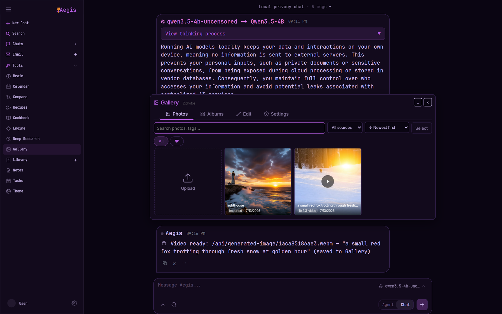

<h1 align="center">Aegis</h1>

<p align="center">
  <b>Your own AI workspace — every model, agent, and tool running on your hardware.</b><br>
  Private by default. No cloud accounts, no API keys, no per-token bill.
</p>

<p align="center">
  <a href="QUICKSTART.md">Quickstart</a> ·
  <a href="docs/setup.md">Setup</a> ·
  <a href="docs/engine-setup.md">Local engine</a> ·
  <a href="ROADMAP.md">Roadmap</a>
</p>

<p align="center">
  
</p>

---

## What Aegis is

Aegis is a **fully self-hosted AI workspace**. Chat, autonomous agents, deep research,
coding, a web browser the AI can drive, image generation, and voice — all in one place,
all running on **your machine**. Nothing you do leaves your hardware unless you choose to
send it.

The premise is simple: the most capable AI tools shouldn't require renting someone else's
computer and handing over your data to use them. If you have a GPU, you should be able to
run a private assistant that browses, writes and runs code, researches, makes images, and
talks with you — and **own the whole thing**.

**What it unlocks**

- **Sovereignty** — your models, your data, your machine. Works offline; nothing is metered,
  logged, or trained on by a third party.
- **No ceiling** — run as much as your hardware allows. No usage caps, no per-token cost, no
  rate limits.
- **One integrated loop** — models, agents, knowledge, memory, and media work *together*
  instead of scattered across a dozen apps, tabs, and subscriptions.
- **Cloud-grade capability, self-owned** — the agent can browse the web, edit real code in a
  git repo, generate images, and take voice commands — locally.

**Where it's headed:** the default self-hosted AI environment for people who want serious
capability without surrendering privacy or control — extensible (MCP tools, visual workflows,
skills), approachable (one dashboard, one-click "try it"), and honest about running on
hardware you own. See the [roadmap](ROADMAP.md).

## What you can do

**Talk to models, locally**
- Chat with any local GGUF or API model — with tools, files, shell, skills, and long-term memory.
- A **local model engine** (llama.cpp + llama-swap) hot-swaps GGUFs through one endpoint with
  reliable **native tool calls**; drop a model in `models/` and serve it; the **context
  auto-tuner** (`/engine`) sizes each model's window to your GPU automatically.

**Put agents to work**
- **Toolboxes** — summon themed tool sets: OSINT recon, market analysis, network troubleshooting, web crawl.
- **Recipes** — chain tools and models into visual workflows, with branch and loop logic.
- **Deep Research** — multi-step web research with source reading and report generation.
- **Browser automation** — the agent navigates, reads, and clicks real web pages.

**Build software**
- **Coding agent** (`/code`) — edits real files in a git-aware workspace.
- **Code Canvas** (`/canvas`) — generate code, edit it inline, tell the AI what to change, and **run it**.
- **Repo → Wiki** (`/wiki`) — turn any local repo into a structured Overview / Architecture / module guide.

**Create & converse**
- **Image generation** — fully local diffusion, OpenAI-images-compatible.
- **Voice** — on-device speech-to-text + text-to-speech, plus a hands-free **Voice Mode**:
  speak, the agent acts, it reads the reply back.
- **Vision** — a local vision model for images and screenshots.

**Stay organized**
- AI-assisted **Documents**, **Email** (IMAP/SMTP triage + drafts), **Notes / Tasks / Calendar**
  (reminders, scheduled agent tasks, CalDAV), a **gallery / image editor**, and **web search**.

**Own the operation**
- **Control Center** — one dashboard with every capability's live status and a one-click "try it."
- **Doctor** (`/doctor`) — self-check with guarded, one-click fixes for anything missing.
- **Local observability** (`/traces`) and **knowledge-graph memory** (`/graph`) — insight and
  recall that never leave the machine.
- Runs **natively on Windows** (no Docker required) or via Docker.

> The local inference binaries (llama.cpp, llama-swap, Node/Playwright, Aider,
> stable-diffusion.cpp) install with one command — see the
> **[engine setup guide](docs/engine-setup.md)**.

## Screenshots

Everything below was produced on a single machine (one RTX 4090) by models Aegis
serves locally — including the video and the photos.

**Local video generation.** `/video a small red fox trotting through fresh snow at
golden hour` submits an async job to the engine (Wan 2.2 or LTX-2.3 under
stable-diffusion.cpp) and streams progress right into the chat until the clip lands:


The finished clip — LTX-2.3, rendered locally in about three minutes, audio included:

<p align="center">
  
</p>

**One engine, many models.** The picker lists every GGUF served through llama-swap —
chat, coding, vision, image, and video models — with a live "loaded in VRAM" indicator:


**Image generation and gallery.** Generated media lands in the Gallery next to your
own photos (this lighthouse came out of a served Qwen-Image model in 8 steps):




**AI image editor.** Masked inpaint, background removal, upscaling, and full-image
instruction edits, driven by a served edit model (Qwen-Image-Edit):


**Control Center.** One dashboard for the engine, VRAM, models, agents, and every
capability's health:


## Quick Start

New here? The **[Quickstart guide](QUICKSTART.md)** covers everything from
first launch to connecting your first model.

### Windows (native, no Docker)

Double-click `launch-windows.bat`, or from a terminal:

```powershell
.\launch-windows.bat
```

This creates a virtualenv, installs dependencies, runs first-time setup, and
starts the server at `http://127.0.0.1:7000`. Requires Python 3.11+.

### Linux / macOS (native, no Docker)

```bash
./start-linux.sh    # Linux -- requires Python 3.11+
./start-macos.sh    # macOS
```

### Docker

```bash
cp .env.example .env
docker compose up -d --build
```

Open `http://localhost:7000` when the containers are healthy.

Log in with **admin / admin** and change the password after first login
(Settings → Account). Native installs, GPU notes, Windows/macOS instructions,
HTTPS, and configuration live in the [setup guide](docs/setup.md).

## Security

Aegis is a self-hosted workspace with powerful local tools. Keep auth enabled, keep private data out of Git, and do not expose raw model/service ports publicly. Deployment details are in the [setup guide](docs/setup.md#security-notes).

## License

AGPL-3.0-or-later -- see [LICENSE](LICENSE) and [ACKNOWLEDGMENTS.md](ACKNOWLEDGMENTS.md).

Aegis began as a fork of [Odysseus](https://github.com/pewdiepie-archdaemon/odysseus)
(AGPL-3.0-or-later) and has grown well beyond it; with thanks for the foundation. Full
attribution is in [ACKNOWLEDGMENTS.md](ACKNOWLEDGMENTS.md).
