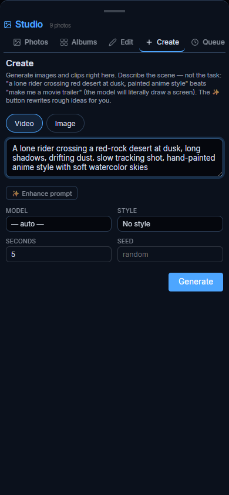

# Studio — generate, edit, stitch

The Studio is where generated media lives — and where it gets made: your photos
and clips, a Create panel for new generations, the image editor, the movie
maker, your style presets, the model library, and a queue that tells you what
the machine is busy with.

Open it from the sidebar, with `/studio`, or `/open Studio`. (It used to be called
the Gallery — `/gallery` still works.)

---

## Photos & Albums

Everything you generate lands here next to your own uploads: images, video clips,
and finished films. Search by prompt or tag, filter by source model, and let a
local vision model auto-tag the lot (Settings → AI Tagging).

## Edit

Masked inpaint, background removal, upscaling, and full-image instruction edits,
driven by a served edit model. Any still also grows an **Animate** button that
turns it into a video clip starting on that exact frame.

---

## Create

Generate images and clips without leaving the Studio: prompt, model, style,
duration (video) or size (image), seed — one panel. Videos hand off to the
**Queue** tab; images resolve in place. Everything lands in Photos, where the
Movie tab can pick it up. All video is stored as **MP4** (renders that come out
of the engine as webm are transcoded automatically — smaller files, and they
play everywhere).

Two things that make results dramatically better:

- **Describe the scene, not the task.** Diffusion models depict; they don't
  obey. Ask for *"a movie trailer in the style of Studio Ghibli"* and the model
  will literally draw an ornate screen with a blurry movie playing on it
  (observed). Ask instead for what the camera sees: *"a lone rider crossing a
  red-rock desert at dusk, long shadows, slow tracking shot, hand-painted anime
  style."* The **✨ Enhance prompt** button does this rewrite for you with the
  local utility model.
- **A "trailer" is several shots, not one clip.** Generate each shot in Create
  (with one style preset active so they match), watch them land in Photos, then
  assemble them in the Movie tab.

Duration goes up to ~10s on LTX models (24fps) and ~16s on Wan (16fps) — the
engine caps at 257 frames either way.

## Movie

Local models make short clips — 2 to 10 seconds. The **Movie** tab stitches
several into one film.

Click clips to add them, drag rows to reorder (or use ↑/↓), and set **from**/**to**
on any row to trim its head and tail. Leave them blank to use the whole clip. The
bar shows the running total. Give it a title, hit **Build movie**, and the film
lands in your Studio like any other clip.

Worth knowing:

- **Mismatched clips are fine.** Wan and LTX render at different sizes and
  framerates. Every clip is scaled and padded to one canvas (the largest) and
  resampled to one framerate (the highest), then re-encoded. That's slower than a
  straight copy but it always works — the ffmpeg concat *demuxer* silently
  requires identical streams, which generated clips rarely are.
- **Mixed audio is fine.** LTX-2 emits audio; Wan doesn't. Silent clips get a
  generated silent track so the film keeps audio from the clips that have it,
  instead of dropping it everywhere.
- **Style is what makes it a film.** Activate a preset (Studio → Styles) before
  generating your shots and they share a model, seed, prompt affixes and LoRAs —
  which is what makes separate clips read as one piece rather than a pile.
- It's ffmpeg on the CPU, so building a film doesn't compete with a render for
  the GPU. Both can run at once.

## Styles

A preset locks a model, prompt prefix/suffix, negative prompt, seed, steps, CFG,
size and LoRAs into a named look. Activate one and every image and video
generation matches it, until you turn it off. Also drivable with `/style`.

## Queue

One list of everything slow: renders, films, automations, and research. It shows
what's running with progress, what's next in line, what recently finished (with a
link to the result), and a cancel button on anything live.

Media renders run **one at a time** — they share a single GPU.

---

## Chat while a render runs

This one is worth understanding, because the naive version silently destroys work.

A diffusion model fills the card (Qwen-Image sits at roughly 23.6GB of a 24GB
4090), and llama-swap resolves model contention by **eviction**. So a chat message
during a render would stop the image/video server mid-job to load your chat model.
The render dies, and nothing tells you why.

There is no VRAM left to share, so Aegis takes the only option that works: while a
render is live, chat is answered by **`chat-lite-cpu`** — a small model pinned
entirely to the CPU (`--device none`, so it takes no VRAM at all, not even a CUDA
context). Chat says so in the reply header, and goes back to your real model the
moment the GPU frees up.

Two pieces make that work, and both are needed:

- `engine/llama-swap.yaml` puts `chat-lite-cpu` in a group with
  `exclusive: false` (loading it never evicts a render) and `persistent: true`
  (a render never evicts it). Without the group, llama-swap evicts either way.
- The app checks the queue before each turn and routes accordingly.

**Turning it off:** set `gpu_busy_fallback` to `off` in settings. Chat then always
uses your selected model — and a message sent during a render will kill it.

**Using a different fallback:** point `gpu_busy_fallback_model` at another
llama-swap alias. It must be in a non-exclusive, persistent group and should be
CPU-only; if it isn't served, Aegis logs a warning and leaves chat alone rather
than handing you a 404.

Agent mode swaps too, and shrinks its context budget to the CPU model's window
(32K) — your coder model's 45K window would otherwise overflow it.

---

## On your phone

The Studio works at phone width — the tab bar scrolls, movie rows wrap, and the
whole modal goes full-screen:

  

For remote use, pair Aegis with [Tailscale](https://tailscale.com): install it on
the PC and phone, then `tailscale serve 7000` publishes the app as
`https://<your-pc>.<tailnet>.ts.net` — real HTTPS (so the service worker and
Voice Mode's microphone work in Safari), visible only inside your tailnet, with
Aegis still bound to localhost. Add to Home Screen and it's an app.

---

## Under the hood

Style presets are JSON under `data/styles/`; films are built by
`src/video_editing.py` (ffmpeg from `imageio-ffmpeg` — Playwright's bundled build
lacks libx264 and the filters) and orchestrated by `src/movie_maker.py`. The queue
is `src/job_queue.py`, and the chat routing is `src/gpu_guard.py`. Clip paths are
confined to `data/generated_images/`, because ffmpeg will read whatever it's given.
